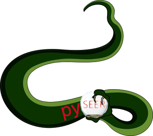

.. pyseer documentation master file, created by
   sphinx-quickstart on Thu Feb  1 13:55:57 2018.
   You can adapt this file completely to your liking, but it should at least
   contain the root `toctree` directive.

pyseer documentation
==================================
``pyseer`` was first written a python reimplementation of `seer <https://github.com/johnlees/seer>`_, which was written in C++.
``pyseer`` uses linear models with fixed or mixed effects to estimate the
effect of genetic variation in a bacterial population on a phenotype of
interest, while accounting for potentially very strong confounding population
structure. This allows for genome-wide association studies (GWAS) to be performed in
clonal organisms such as bacteria and viruses.

The original version of ``seer`` used sequence elements (k-mers) to represent
variation across the pan-genome. ``pyseer`` also allows variants stored in VCF
files (e.g. SNPs and INDELs mapped against a reference genome) or Rtab files
(e.g. from `roary <https://sanger-pathogens.github.io/Roary/>`_ or
`piggy <https://github.com/harry-thorpe/piggy>`_ to be used too). There are also a greater range of association models
available, and tools to help with processing the output.

Testing shows that results (p-values) should be the same as the original
``seer``, with a runtime that is roughly twice as long as the optimised C++
code.

We have also extended ``pyseer`` to fit association models to the whole genome, which also
allows the use of machine learning to predict traits in new samples.

Citations
---------
If you find pyseer useful, please cite:

:emphasis:`Lees, John A., Galardini, M., et al. pyseer: a comprehensive tool for microbial pangenome-wide association studies.
Bioinformatics 34:4310–4312 (2018). doi:10.1093/bioinformatics/bty539.`

If you use unitigs (through `unitig-counter <https://github.com/johnlees/unitig-counter>`__) please cite:

:emphasis:`Jaillard M., Lima L. et al. A fast and agnostic method for bacterial genome-wide association
studies: Bridging the gap between k-mers and genetic events. PLOS Genetics. 14, e1007758 (2018). doi:10.1371/journal.pgen.1007758.`

The whole genome/predictive models:

:emphasis:`Lees, John A., Mai, T. T., et al. Improved inference and prediction of bacterial genotype-phenotype associations 
using interpretable pangenome-spanning regressions. (2020)`
Preprint: `<https://doi.org/10.1101/852426>`__

.. toctree::
   :maxdepth: 2
   :caption: Contents:

   self
   installation.rst
   options.rst
   best_practices.rst
   usage.rst
   tutorial.rst
   predict.rst
   multiprocessing.rst
   api.rst

Index:
------

* :ref:`genindex`
* :ref:`search`
