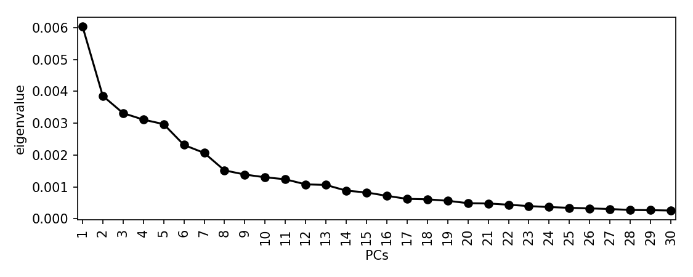
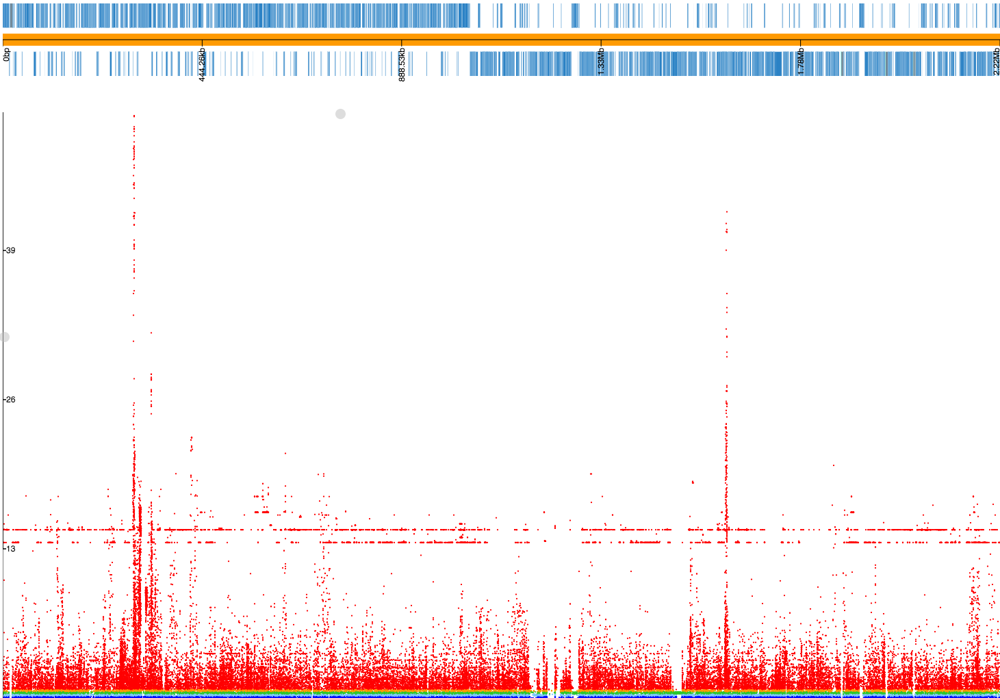
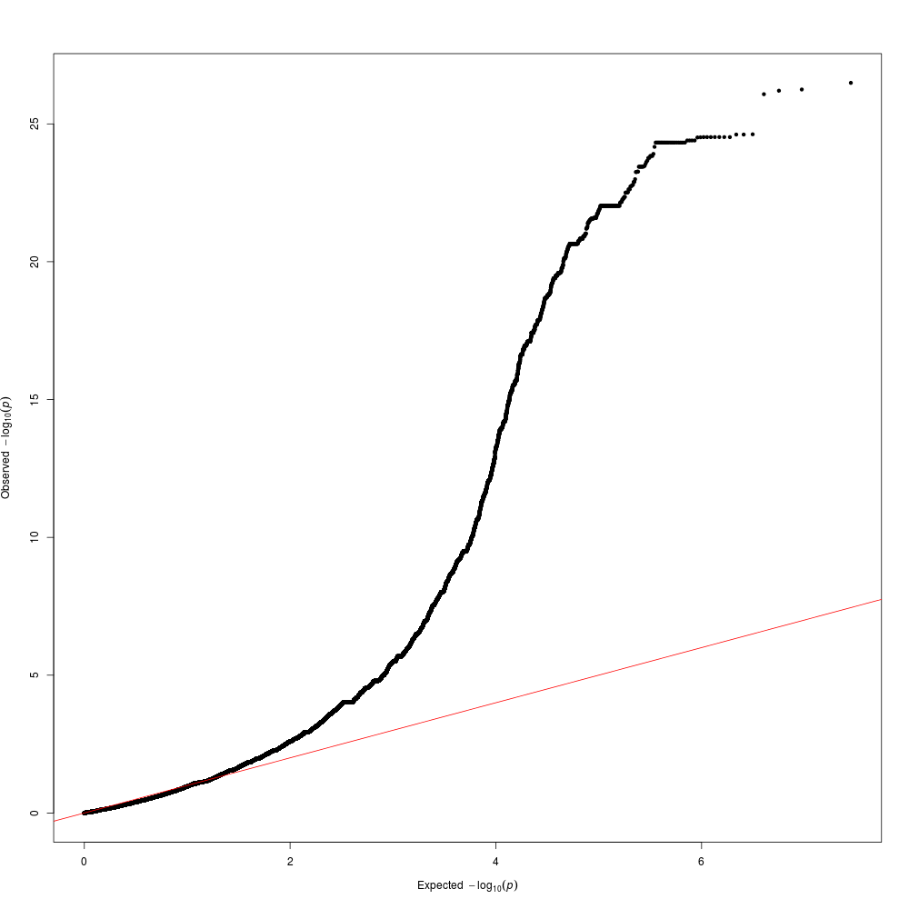

Tutorial
========

.. |nbsp| unicode:: 0xA0
   :trim:

For a short introduction to bacterial GWAS, you may wish to read
`this review <https://figshare.com/articles/The_background_of_bacterial_GWAS/5550037/files/9624721.pdf>`_.

This tutorial shows how to use ``pyseer`` to perform a GWAS for penicillin
resistance using 616 *S.*\ |nbsp| \ *pneumoniae* genomes collected from Massachusetts.
These genomes were first reported `here <https://www.nature.com/articles/ng.2625>`_ and can be accessed
`here <https://www.nature.com/articles/sdata201558>`_. One of the earliest GWAS
studies in bacteria was performed using this data, and we will try and
replicate `their results <http://journals.plos.org/plosgenetics/article?id=10.1371/journal.pgen.1004547>`_.

The data for this tutorial can be accessed at TODO. Extract the archive::

   tar xf pyseer_tutorial.tar.gz

To find the following files:

===========================  ========
File                         Contents
===========================  ========
assemblies.tar.bz2           Archive of genome assemblies.
fsm_file_list.txt            Input to run fsm-lite.
snps.vcf.gz                  SNPs mapped against the Spn23F reference.
gene_presence_absence.Rtab   Output from roary run on these genomes.
core_genome_aln.tree         IQTREE phylogeny (using ``-m GTR``) from the core genome alignment.
resistances.pheno            Whether an isolate was resistant to penicillin, to be used as the phenotype.
mash_sketch.msh              mash sketch output, from running ``mash sketch -s 10000 -o mash_sketch *.fa``.
Spn23F.fa                    `23FSpn <http://jb.asm.org/content/191/5/1480>`_ sequence.
Spn23F.gff                   `23FSpn <http://jb.asm.org/content/191/5/1480>`_ sequence and annotation.
6952_7#3.fa                  The draft sequence assembly of one isolate in the collection.
6952_7#3.gff                 The draft annotation of the isolate.
===========================  ========

SNP and COG association with fixed effects model
------------------------------------------------
We will first of all demonstrate using ``pyseer`` with the original ``seer`` model,
using MDS components as fixed effects to control for the population structure.
We will test the association of SNPs mapped to a reference (provided as a VCF file) and COG
presence/absence (provided as and Rtab file, from running roary on the
annotations).

The first step is to estimate the population structure. We will do this using
a pairwise distance matrix produced using ``mash``. Either create the mash
sketches yourself::

   tar xf assemblies.tar.bz2
   mash sketch -s 10000 -o mash_sketch *.fa

or use the pre-computed ``mash_sketch.msh`` directly. Next, use these to
calculate distances between all pairs of samples::

   mash dist mash_sketch.msh mash_sketch.msh| python square_mash-runner.py > mash.tsv

Let's perform an MDS and these distances and look at a scree plot to choose the number of
dimensions to retain::

   python scree_plot-runner.py mash.tsv

There is a drop after about 8 dimensions, so we will use this many. This is
subjective, and you may choose to include many more.

We can now run the analysis on the COGs::

   python pyseer-runner.py --phenotypes resistances.pheno --pres gene_presence_absence.Rtab --distances mash.tsv --save-m mash_mds --max-dimensions 8 > penicillin_COGs.txt

Which prints the following to STDERR::

   Read 603 phenotypes
   Detected binary phenotype
   Structure matrix has dimension (616, 616)
   Analysing 603 samples found in both phenotype and structure matrix
   10944 loaded variants
   4857 filtered variants
   6087 tested variants
   6087 printed variants

``pyseer`` has automatically matched the sample labels between the inputs, and
only used those which were present in the phenotype file. This has accounted
for the fact that not all of the samples were measured for the current
phenotype. We have used the default filters, so only intermediate frequency
COGs have been considered. The core genome COGs and low frequency COGs are in
the 4857 filtered out. Take a look at the top hits::

   sort -g -k4,4 penicillin_COGs.txt | head

   variant af      filter-pvalue   lrt-pvalue      beta    beta-std-err    intercept       PC1     PC2     PC3     PC4     PC5     PC6     PC7     PC8 notes
   group_4276      7.79E-02        1.27E-11        2.70E-21        1.29E+01        7.12E-01        -1.29E+00       -7.01E-01       -2.75E+00       -6.64E+00    -9.02E-01       1.46E+01        -3.83E+00       -6.05E-01       -4.25E+00       high-bse
   group_4417      8.96E-02        3.21E-09        4.72E-20        -6.08E+00       6.99E-01        -4.51E-01       -1.12E+00       5.08E-01        -5.61E+00    8.20E-01        8.19E+00        -4.95E-01       -4.53E-01       9.70E-01        bad-chisq
   cpsG    1.18E-01        1.34E-16        1.69E-19        3.77E+00        5.25E-01        -1.34E+00       2.49E+00        1.24E-01        -5.19E+00   6.57E-01 1.01E+01        8.38E-02        -3.06E-01       8.48E-01
   group_3096      1.18E-01        1.34E-16        1.69E-19        3.77E+00        5.25E-01        -1.34E+00       2.49E+00        1.24E-01        -5.19E+00    6.57E-01        1.01E+01        8.38E-02        -3.06E-01       8.48E-01
   group_5738      1.18E-01        1.34E-16        1.69E-19        3.77E+00        5.25E-01        -1.34E+00       2.49E+00        1.24E-01        -5.19E+00    6.57E-01        1.01E+01        8.38E-02        -3.06E-01       8.48E-01
   group_8161      1.18E-01        1.34E-16        1.69E-19        3.77E+00        5.25E-01        -1.34E+00       2.49E+00        1.24E-01        -5.19E+00    6.57E-01        1.01E+01        8.38E-02        -3.06E-01       8.48E-01
   group_8834      1.18E-01        1.34E-16        1.69E-19        3.77E+00        5.25E-01        -1.34E+00       2.49E+00        1.24E-01        -5.19E+00    6.57E-01        1.01E+01        8.38E-02        -3.06E-01       8.48E-01
   mnaA    1.18E-01        1.34E-16        1.69E-19        3.77E+00        5.25E-01        -1.34E+00       2.49E+00        1.24E-01        -5.19E+00   6.57E-01 1.01E+01        8.38E-02        -3.06E-01       8.48E-01
   tagA    1.18E-01        1.34E-16        1.69E-19        3.77E+00        5.25E-01        -1.34E+00       2.49E+00        1.24E-01        -5.19E+00   6.57E-01 1.01E+01        8.38E-02        -3.06E-01       8.48E-01

Note that the first two rows have notes ``high-bse`` and ``bad-chisq``
respectively. For the former this may represent a high effect size, low
frequency results. For the latter this is likely due to the MAF filter not
being stringent enough. The identical p-values of the other results are as these COGs
appear in exactly the same set of samples.

We will now perform an analysis using the SNPs produced from mapping reads
against the provided reference genome. To speed up the program we will load the
MDS decomposition from the COG analysis above::

   python pyseer-runner.py --phenotypes resistances.pheno --vcf snps.vcf.gz --load-m output/mash_mds.pkl --lineage --print-samples > penicillin_SNPs.txt

This gives similar log messages::

   Read 603 phenotypes
   Detected binary phenotype
   Loaded projection with dimension (603, 269)
   Analysing 603 samples found in both phenotype and structure matrix
   Writing lineage effects to lineage_effects.txt
   198248 loaded variants
   81370 filtered variants
   116878 tested variants
   116700 printed variants

We haven't specified the number of MDS dimensions to retain, so the default of
10 will be used (anything up to the 269 retained positive eigenvalues could be
chosen). Turning on the test for lineage effects with ``--lineage`` uses the
MDS components as the lineage, and writes the lineages most associated with
the phenotype to ``lineage_effects.txt``::

   lineage Wald_test       p-value
   MDS3    10.3041807281   0.0
   MDS10   6.61332035523   3.75794950713e-11
   MDS5    6.03559150525   1.58381441295e-09
   MDS4    2.35736678835   0.0184050574981
   MDS6    1.33118701438   0.183127483126
   MDS2    1.02523510885   0.305252266
   MDS9    0.850386297867  0.39511035157
   MDS7    0.780676383001  0.434992854366
   MDS1    0.478181602218  0.632520955891
   MDS8    0.344928992152  0.730147754076

Variants associated with both the phenotype and MDS3, MDS10 or MDS5 may
therefore be of interest as lineage effects.

The output now includes the lineage each variant is associated with, though not
all variants can be assigned a lineage. ``--print-samples`` forces the
inclusion of a comma separated list of samples the variant is present in
``k-samples`` and not present in ``nk-samples`` (not shown here for brevity)::

   variant af      filter-pvalue   lrt-pvalue      beta    beta-std-err    intercept       PC1     PC2     PC3     PC4     PC5     PC6     PC7     PC8 PC9      PC10    lineage notes
   26_23_G 4.31E-02        3.31E-01        4.42E-01        -4.19E-01       5.49E-01        -9.22E-01       1.84E-01        -6.00E-01       -7.53E+00   8.84E-01 2.05E+01        -1.79E+00       2.69E-01        1.16E-01        -7.52E-01       3.66E+00        MDS1
   26_31_G_T       5.64E-02        3.94E-06        1.00E+00        6.78E-01        6.92E-01        -8.90E-01       1.97E-01        -4.13E-01       -7.05E+00    8.63E-01        1.91E+01        -1.33E+00       3.02E-01        9.13E-02        -4.99E-01       3.35E+00        MDS10   bad-chisq
   26_83_A_G       4.58E-01        9.88E-04        3.25E-01        4.06E-01        4.13E-01        -1.21E+00       -1.43E-01       -7.84E-01       -7.35E+00    6.13E-01        1.91E+01        -1.19E+00       1.73E-01        6.44E-01        -4.47E-01       3.63E+00        MDS6
   26_109_G_A      1.33E-02        1.46E-01        2.10E-14        4.15E+01        7.25E-01        -9.97E-01       9.39E-02        3.33E-02        -9.52E+00    1.72E+00        3.41E+01        1.38E+00        4.43E-01        -1.20E+00       6.82E-02        4.28E+00
   26_184_G_A      3.32E-02        1.06E-02        8.49E-01        1.75E-01        9.11E-01        -9.65E-01       1.37E-01        -5.96E-01       -7.42E+00    8.65E-01        1.98E+01        -1.71E+00       3.00E-01        2.78E-01        -6.18E-01       3.63E+00
   26_281_C_T      1.01E-01        1.20E-05        3.97E-01        -5.91E-01       6.91E-01        -9.08E-01       1.12E-01        -7.04E-01       -7.24E+00    7.18E-01        2.02E+01        -1.73E+00       4.32E-01        3.50E-01        -6.84E-01       3.69E+00        MDS4
   26_293_G_A      1.49E-02        3.50E-01        5.31E-01        7.06E-01        1.07E+00        -9.73E-01       1.29E-01        -6.11E-01       -7.49E+00    9.16E-01        2.03E+01        -1.54E+00       3.02E-01        2.55E-01        -5.93E-01       3.66E+00        MDS6
   26_483_G_A      2.37E-01        7.85E-02        1.82E-02        9.16E-01        3.90E-01        -1.32E+00       -2.83E-01       -1.30E+00       -7.28E+00    6.77E-01        1.78E+01        -1.79E+00       2.59E-01        1.10E+00        3.15E-02        3.44E+00        MDS9
   26_539_G_A      1.33E-02        1.46E-01        2.10E-14        4.15E+01        7.25E-01        -9.97E-01       9.39E-02        3.33E-02        -9.52E+00    1.72E+00        3.41E+01        1.38E+00        4.43E-01        -1.20E+00       6.82E-02        4.28E+00

This contains co-ordinates and p-values, which can be converted to a ``.plot``
file using the following ``awk`` one-liner::

   cat <(echo "#CHR SNP BP minLOG10(P) log10(p) r^2") \\ 
   <(paste <(sed '1d' penicillin_SNPs.txt | cut -d "_" -f 2) \\
   <(sed '1d' penicillin_SNPs.txt | cut -f 4) | \\
   awk '{p = -log($2)/log(10); print "26",".",$1,p,p,"0"}' ) | \\
   tr ' ' '\t' > penicillin_snps.plot

If we drag and drop ``23FSpn.gff`` and ``penicillin_snps.plot`` files into
`phandango <http://jameshadfield.github.io/phandango/#/>`_ you should see
a Manhattan plot similar to this:

Although there are flat lines suggesting lineage effects from population
structure that has not been fully controlled for, the three highest peaks are
in the *pbp2x*, *pbp1a* and *pbp2b* genes, which are the correct loci.

K-mer association with mixed effects model
------------------------------------------
We will now use k-mers as a variant to test both short variation as well as
gene presence/absence. This can be done using the steps above replacing the
``--vcf`` argument with ``--kmers``, which would replicate the results from the
original ``seer`` tutorial. For demonstration purposes we will instead use the
other association model available in ``pyseer``, the linear mixed model.

First, count the k-mers from the assemblies::

   tar xf assemblies.tar.bz2
   fsm-lite -l fsm_file_list.txt -s 6 -S 610 -v -t fsm_kmers | gzip -c - > fsm_kmers.txt.gz

This will require you to have `fsm-lite <https://github.com/nvalimak/fsm-lite>`_. installed
If you do not have the time/resources to do this, you can follow the rest of these steps using the
SNPs as above.

To correct for population structure we must supply ``pyseer`` with the kinship
matrix :math:`K` using the ``--similarities`` argument (or ``--load-lmm`` if using
a previous analysis where ``--save-lmm`` was used).

We will use the patristic distances from the core genome phylogeny, which
has been midpointed rooted::

   python scripts/phylogeny_distance.py --calc-C core_genome_aln.tree > phylogeny_K.tsv

.. note:: Alternatively, we could extract a kinship matrix from the mapped SNPs by calculating :math:`K = GG^T`
   ``python similarity-runner.py --vcf snps.vcf.gz samples.txt > gg.snps.txt``

We can now run ``pyseer`` with ``--lmm``. Due to the large number of k-mers we are going to test, we will increase the
number of CPUs used to 8::

   python pyseer-runner.py --lmm --phenotypes resistances.pheno --kmers fsm_kmers.txt.gz --similarity phylogeny_K.tsv --output-patterns kmer_patterns.txt --cpu 8 > penicillin_kmers.txt

The heritability :math:`h^2` estimated from the kinship matrix :math:`K` is printed to STDERR::

   Read 603 phenotypes
   Detected binary phenotype
   Setting up LMM
   Similarity matrix has dimension (616, 616)
   Analysing 603 samples found in both phenotype and similarity matrix
   h^2 = 0.90

.. warning:: The heritability estimate shouldn't be interpreted as a quantitative measure
   for this binary phenotype, but a high heritability is consistent with the mechanism of penicillin
   resistance in this species.

The downstream processing of the k-mer results in ``penicillin_kmers.txt`` will be
shown in the next section. Before that, we can determine a significance threshold
using the number of unique k-mer patterns::

   python scripts/count_patterns.py kmer_patterns.txt

#TODO run this, compare with total

We can also create a Q-Q plot to check that p-values are not inflated. We will
first extract the p-value column::

   sed '1d' penicillin_kmers.txt | cut -f 4 > pvals.txt

Then we can use the qqman R package to produce a Q-Q plot. Run the following
commands in ``R``::

   require(qqman)
   png("qqplot.png", width = 1000, height = 1000)
   pvals = read.table("pvals.txt", header=F)
   qq(pvals$V1)
   dev.off()

This produces the following Q-Q plot, which is well controlled at low p-values
and doesn't show any 'shelves' sympotmatic of lineage effects:

Interpreting significant k-mers
-------------------------------

